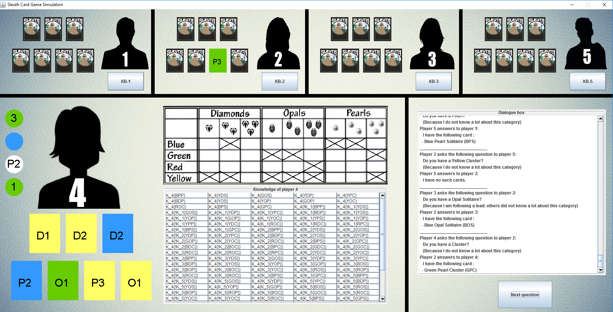

# Introduction

This website contains information about a Simulator of the logical deduction card-game Sleuth. This is a project for the Multi-Agent Systems course of 2016/2017, made by Richard Elderman & Cor Steging.    
The application that we wrote can simulate a game of Sleuth with five AI Agents that play the game. The model of the game is based on the S5(m) logic system and the agents will use their knowledge about the world and the knowledge of other agents to make decisions and win the game. The goal of this simulation is to show how the knowledge of the agents will lead to the decisions that they make and how they can use this information to alter their strategy. 

## The Game of Sleuth
Sleuth is a logical deduction game in which you need to reason about the knowledge of your opponents. The game consists of a deck of Gem-Cards, each with three properties: Color, Type and Quantity (e.g. Red Diamond Solitaire). At the beginning of the game, one of these cards is removed from the deck: this is the hidden gem. The rest of the cards are divided amongst the players. Each player is dealt four Question-Cards, which they can use on their turn to ask questions to other players about their cards. Through logical deduction about the knowledge of the other players, players can discover what the hidden gem is and win the game.    
The deck of Gem-Cards consists of 36 unique cards that encompass all the possible combinations of Color (Red, Green, Yellow, Blue), Type (Diamond, Opal, Pearl) and Quantity (Solitaire, Pair, Cluster). There are three types of Question-Cards that the players can use to ask questions with: one-element, two-element and free-choice question cards. A one-element Question-Card contains one property (e.g. Red) and allows the player to ask another player for all of the Gem-Cards that he or she has that share that one property. Similarly, two-element Question-Card contain two properties (e.g. Red Solitaire), which players can use to ask for all of the Gem-Cards of another player that share both of these properties. The free-choice Question-Card can be used to ask either a one-element or a two-element question with properties that the player can choose him or herself. There are 10 one-element, 33 two-element and 11 free-choice Question-Cards.   
In each round, the player whose turn it currently is can ask a question to one of the other players with the use of a Question-Card. The latter player has to respond by showing all of his cards that match the properties of the Question-Card to the former player. Apart from these two players, no other player can see this exchange of information. After a question has been answered, the current player removes the used Question-Card from his hand and places back on the bottom of the deck, after which he draws a new Question-Card from the top of the deck. This is the end of that players turn. Players take turns in asking each other questions until one of the players can determine what the hidden gem is and subsequently win the game.   

## Model of the Game
The model that we created is based on S5(m) logic, which is a mixed modal logic system. In this system, the most basic propositions are the Gem-Cards, where an occurrence of a Gem-Card indicates that the Gem-Card is in the game, and is thus **not** the hidden gem. These propositions are abbreviated using the first letter of each of its properties, so for example the Red Diamond Solitaire is represented as RDS.   
Each player has a set of knowledge about the world, which we refer to as the knowledge base of the player. The most basic pieces of knowledge that are contained within this knowledge base is the first-level knowledge. First-level knowledge is a combination of a player that the knowledge belongs to and the Gem-Card that this player knows is in the game. For example, if Player 1 knows that the Red Diamond Solitaire is in the game, this is represented as K1(RDS). Due to Axiom A3 of the S5(m) logic system, this implies that this Gem-Card is in the game: K1(RDS) &#8594; RDS.  
The agents are also able to use higher-level knowledge, which is knowledge about knowledge. For example, Player 1 can know that Player 2 knows that the Red Diamond Solitaire is in the game: K1(K2(RDS)). More importantly, as will be discussed in the next section about the reasoning of the agents, this makes it possible for players to know that another player does not know a particular Gem-Card.   
Additionally, all of the Gem-Cards that the player does not know are held for possible. This is represented as, for instance, M1(RDS), which states that Player 1 holds it for possible that the Red Diamond Solitaire is in the game, but it might also be the hidden gem.

## Agents
The agents gain most of their knowledge from answers to questions that they pose to other agents. However, they can make use of a number of reasoning strategies in the simulation. This reasoning can be divided into three types: reasoning about what the hidden gem might be, reasoning about what Question-Card to use and who to ask the question to, and the inference of new knowledge based on previous information and answers from other players.

### Gaining knowledge from answers
After the current player, agent _a_, has asked a question to Player _p_, agent _a_ will receive a list of all of the Gem-Cards that player _p_ has that meet the description in the question. Agent _a_ can first and foremost add these Gem-Cards as new knowledge to its database, in the form of Ka(X) for every Gem-Card X. Of course agent _a_ knows that player _p_ knows this card as well, therefore we can add  Ka(Kp(X)) to the knowledge base of agent _a_. Additionally, agent _a_ can determine what Gem-Cards player _p_ does not have, by removing the list of provided answers from a list of all of the possible answers that could have been given to the question. In this case, for each card X that meets the description of the Question-Card but was not provided in the answer of player _p_, Ka(&#172;Kp(X)) is added to the knowledge base.  
Moreover, for each of the cards that are included in the list of answers that player _p_ gives, agent _a_ can conclude that these cards are not in the hand of the other players, since player _p_ owns these cards. So for every other player _p'_, which is every player except _p_ and _a_, Ka(&#172;Kp'(X)) can be added to the knowledge base for each Gem-Card X of the answer that player _p_ gave. Trivially, at the start of each game every player knows that the other players are unaware of their cards, and this knowledge is added to the initial knowledge base. 

### Finding the hidden gem: 
 There are two ways for the agent to know what the hidden gem is. The first and most obvious way is to know all the cards that are in the game. If the agent knows all of the cards that are in the game, it will only hold one card for possible, which is the hidden gem.   
 Another way for the agent to figure out what the hidden gem is, is to go through all of the cards that it holds for possible and check whether the other agents know about these cards. If there is a card that the agent holds for possible and the agent knows that none of the other agents know about the card, it must be the hidden gem. 

### Asking Questions:
 Selecting the best question consists of finding the best possible combination of a Question-Card and a player to ask the question to. The main strategy that the agents use is to select a Question-Card and player such that it maximizes the potential gain of new knowledge. The agent will determine a score for each Question-Card and player combination, based on how much new potential knowledge this combination can yield. For example, if the agent does not know a lot of Red Gem-Cards yet and it also has little knowledge about the Gem-Cards of Player 2, this combination of asking Player 2 about his or her Red cards has a high value.   
Another reason for selecting a Question-Card and player is to follow a lead. If a particular Gem-Card is still unknown by the agent, and it knows that a couple of other players do not know the card either, there is a good chance that this Gem-Card is the hidden gem. Therefore the agent can decide to follow this lead by asking the players that could posses the card a question that would reveal whether or not they have it. If they do not have this Gem-Card, the card must be the hidden gem.

### Inferring extra knowledge 
  An agent _a_ can infer new knowledge from its current knowledge in two different ways. This can occur after the agent has asked a question and received an answer, and thus has some new knowledge, which it can use to infer more knowledge at the end of its turn. This additional knowledge could potentially lead the agent to discover the hidden gem. 
 Both ways of inferring new knowledge make use of the fact that each player has exactly 7 cards in his hand. With the use of the knowledge the agent has about a player, he can make three exhaustive lists of Gem-Cards for each player _p_:
 - a list containing all Gem-Cards of which agent _a_ knows that player _p_ has them
 - a list containing all Gem-Cards of which agent _a_ knows that player _p_ does not have them (since _a_ knows that other players have these cards)
 - a list containing all Gem-Cards of which agent _a_ does not know whether player _p_ has them, but _p_ could have them.    
 
 The first type of inference can be made if the first list contains 7 Gem-Cards. This means that agent _a_ knows all of the Gem-Cards that player _p_ has, and that none of the cards in list three (the possible cards) can in fact be owned by player _p_. Therefore he can transfer every card X from the third list to the second list, by adding Ka(&#172;Kp(X)) for each card X to the knowledge base. This can be helpful in finding the hidden gem in the second method that was described earlier.   
 The second type of inference can be made if the first list and the third list combined contain 7 Gem-Cards in total. This means that every card for which agent _a_ has held it for possible that player _p_ might own it, must be owned by _p_. Therefore every card X in the third list can be transferred to the first list, by adding Ka(Kp(X)) for each card X to the knowledge base. Furthermore, for every other player _p'_ it is now known that he does not have these cards, so for each player _p'_ for each card X,  Ka(&#172;Kp'(X)) can be added to the knowledge base.  
 If an agent was able to infer new knowledge about some players, it gets the opportunity to use this new knowledge to try to infer more new knowledge about every player.
  
## Simulator
Clicking [**this link**](http://gofile.me/2T0QB/EvVDJpoBR) will bring you to a page where you can download our Sleuth Simulator. To run the application, Java must be installed on your system, after which you can simply double click the .jar file. 

When you start the simulator, a Graphical User Interface like the one shown above will display the current information about the game. On the bottom left, the avatar of the current player is displayed along with his Gem-Cards on the bottom. On the left side of this avatar, his or her question cards are displayed. Both the Gem-Cards and the Question-Cards are represented in the following way: The color of the card represents the color of the gem (white indicates no color is specified), the letters indicate the type of gem (Diamond, Opal or Pearl) and the number indicates the quantity (Solitaire, Pair or Cluster). The free choice Question-Cards are represented by a question mark.  
On the right of the avatar of the current player, the score sheet of this player is shown. The score sheet is used to mark off all of the gems that the player knows are not the hidden gem. Below this score sheet, we can see the knowledge base of the current player containing all of the knowledge as described in the model section. The dialogue box, all the way on the right of the screen, displays all of the dialogue between the players. The button underneath the dialogue box is used to move to the next stage of the game.  
Additionally, the avatars of the other players, whose turn it currently is not, are shown on the top of the interface. Underneath each of the avatars is a button that will display the knowledge base (KB) of the respective player. On the left of each player, his or her Gem-Cards are shown from the perspective of the current player. 

<html><title>Sleuth Simulator</title></html>

